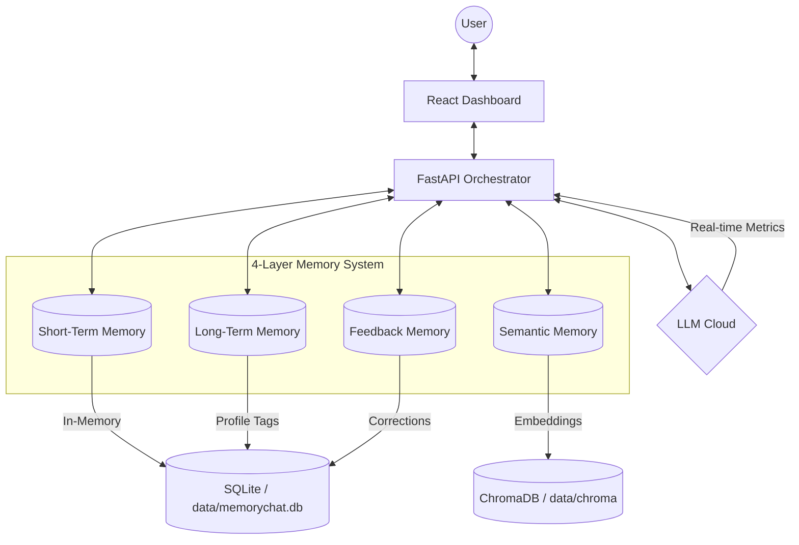

# MemoryChatAI

Production-ready AI SaaS with fully observable memory system.

## Features

- **4-Layer Memory System**: Short-term, Long-term, Semantic, and Feedback memory
- **Observable AI**: Full transparency into memory retrieval and decision-making
- **Token Optimization**: Smart prompt construction with dynamic trimming
- **Multi-LLM Support**: OpenAI, Anthropic (Claude), and **Groq** (Lightning-fast Llama/Mixtral)
- **Production-Ready**: Clean architecture, security, scalability

## Quick Start

### Prerequisites

- Python 3.10+
- Node.js 18+ (for frontend)
- Git

### Backend Setup

1. **Clone the repository**
```bash
git clone <repository-url>
cd MemoryChatAI
```

2. **Create virtual environment**
```bash
cd backend
python -m venv venv
.\venv\Scripts\activate  # Windows
# source venv/bin/activate  # Linux/Mac
```

3. **Install dependencies**
```bash
pip install -r requirements.txt
```

4. **Configure environment**
```bash
copy .env.example .env
# Edit .env and add your API keys
```

5. **Initialize database**
```bash
# Database tables are created automatically on first run
mkdir data
```

6. **Run the server**
```bash
python -m app.main
```

The API will be available at `http://localhost:8000`
- API Documentation: `http://localhost:8000/api/docs`
- Health Check: `http://localhost:8000/health`

### Frontend Setup (Coming Soon)

```bash
cd frontend
npm install
npm run dev
```

## Architecture

### System Diagram



### Memory System Detail

1.  **Short-Term Memory**: Session-based conversation history. Automatically caches context and refreshes the dashboard instantly.
2.  **Long-Term Memory**: Persistent user profiles and interests. Updates dynamically as you share facts about yourself.
3.  **Semantic Memory**: Vector-based search using **ChromaDB**. Retrieves conceptually similar memories from across all your past chats.
4.  **Feedback Memory**: Learning from explicit corrections. Use **"Incorrect:"** to teach the AI and prevent repeated mistakes.

### Tech Stack

- **Backend:** FastAPI, SQLAlchemy, ChromaDB, Pydantic
- **Frontend:** React, Tailwind CSS, Recharts (Observability)
- **Providers:** **Groq** (Recommended for speed), OpenAI, Anthropic

---

## API Endpoints

### Chat
- `POST /api/v1/chat/` - Send message and get response
- `GET /api/v1/chat/conversations` - List conversations
- `GET /api/v1/chat/conversations/{id}` - Get conversation details

### Memory
- `GET /api/v1/memory/profile` - Get user profile
- `PUT /api/v1/memory/profile` - Update user profile
- `POST /api/v1/memory/feedback` - Submit feedback correction

### Authentication
- `POST /api/v1/auth/register` - Register new user
- `POST /api/v1/auth/login` - Login user
- `POST /api/v1/auth/refresh` - Refresh token

### Observability
- `GET /api/v1/observability/metrics` - Prometheus metrics
- `GET /api/v1/observability/traces/{id}` - Request trace details

## Configuration

Key environment variables in `.env`:

```env
# LLM Providers
OPENAI_API_KEY=your-key-here
ANTHROPIC_API_KEY=your-key-here
GROQ_API_KEY=your-key-here

DEFAULT_LLM_PROVIDER=groq  # Options: openai, anthropic, groq
DEFAULT_MODEL=llama-3.3-70b-versatile  # Options: gpt-4, claude-3-opus, llama-3.3-70b-versatile

# Database
DATABASE_URL=sqlite:///./data/memorychat.db
CHROMA_PERSIST_DIR=./data/chroma

# Security
JWT_SECRET_KEY=your-secret-key
ENCRYPTION_KEY=your-encryption-key

# Memory Configuration
MAX_CONTEXT_WINDOW=4096
SUMMARIZATION_THRESHOLD_TOKENS=2000
SEMANTIC_SIMILARITY_THRESHOLD=0.7
```

## Development

### Project Structure

```
MemoryChatAI/
├── backend/
│   ├── app/
│   │   ├── api/v1/          # API endpoints
│   │   ├── core/            # Business logic
│   │   ├── memory/          # Memory system
│   │   ├── models/          # Database models
│   │   ├── services/        # External services
│   │   └── observability/   # Metrics & logging
│   └── tests/               # Unit & integration tests
├── frontend/
│   └── src/
│       ├── components/      # React components
│       ├── hooks/           # Custom hooks
│       └── services/        # API client
└── docs/                    # Documentation
```

### Running Tests

```bash
cd backend
pytest
```

### Docker Deployment

```bash
docker-compose up -d
```

## User Guide: Mastering Memory

The application uses 4 distinct memory layers. Here is how to use them:

### 1. Short-Term Memory (The "Chat Window")
- **How it works:** Keeps track of the last 10 messages in your current conversation.
- **How to trigger:** It's automatic! Just keep chatting.
- **How to identify:** Check the **"Recent Context"** section in the dashboard.
- **Try this:** Ask "What did I just say?"

### 2. Long-Term Memory (The "User Profile")
- **How it works:** Stores persistent facts about you (Interests, Preferences, Personal Info).
- **How to trigger:** State facts about yourself. Example: *"My name is Ramesh"* or *"I am interested in Safe AI"*.
- **How to identify:** Watch the **"User Context"** card in the dashboard update with new tags.
- **Try this:** Say *"My favorite color is Blue"* then restart the conversation and ask *"What is my favorite color?"*

### 3. Semantic Memory (The "Knowledge Vault")
- **How it works:** Searches ALL past conversations globally using ChromaDB. It finds messages that are *conceptually* similar to your current prompt.
- **How to trigger:** Once you have a history of conversations, ask about topics you've discussed before.
- **How to identify:** Look at the **"Semantic Records"** section. It will show relevant snippets from weeks ago.
- **Try this:** Discuss "Climate Change" today. Next week, start a new chat and ask *"What did we talk about regarding the environment?"*

### 4. Feedback Memory (The "Learner")
- **How it works:** Stores explicit corrections to prevent the AI from repeating mistakes.
- **How to trigger:** Use the keyword **"Incorrect:"** followed by the correction. 
- **Example:** *"Incorrect: You called me Bob. My name is Alice."*
- **How to identify:** See your corrections listed in the **"Feedback Memory"** section of the dashboard.
- **Try this:** Correct the AI's behavior explicitly using the prefix above.

---

## Technical Details

## Documentation

- [Architecture Overview](docs/ARCHITECTURE.md)
- [Database Design](docs/DATABASE.md)
- [Memory System](docs/MEMORY.md)
- [API Reference](http://localhost:8000/api/docs)

## Roadmap

- [x] Core memory system implementation
- [x] Chat orchestration pipeline
- [x] Token optimization
- [ ] Frontend dashboard
- [ ] User authentication
- [ ] Rate limiting
- [ ] PostgreSQL migration
- [ ] Redis caching
- [ ] Multi-tenant support

## License

MIT

## Contributing

Contributions welcome! Please read CONTRIBUTING.md first.
